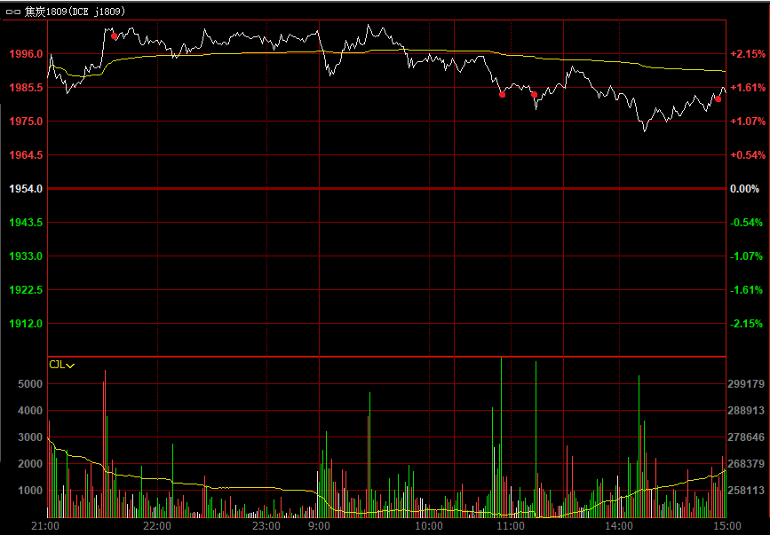

## 操作记录

|序号     |时间            |买卖     |价格         |成交量     |
| ---        | ---              | ---        | ---           | ---            |
|1          |21:50:58     |卖空     |1999.5     |1              |
|2          |10:55:39     |空平     |1982.0     |1              |
|3          |11:12:24     |卖空     |1983.0     |1              |
|4          |14:54:18     |空平     |1982.5     |1              |

## 操作得失

### 失误
1. 第4次操作，1小时级别行情属于向下，但是看到小级别反弹就直接平仓了。

 1. 1小时级别确定大趋势，考虑以前学到的形态
 2. 30分钟级别确定短期趋势
 3. 15分钟、5分钟、1分钟确定买卖点